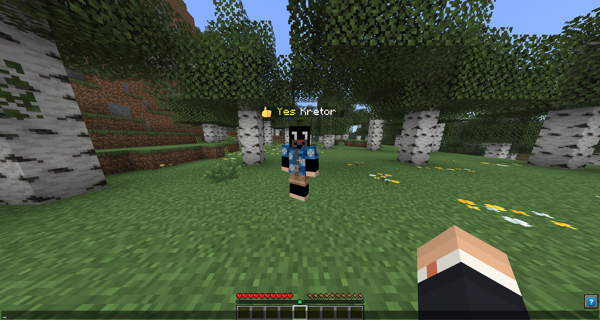
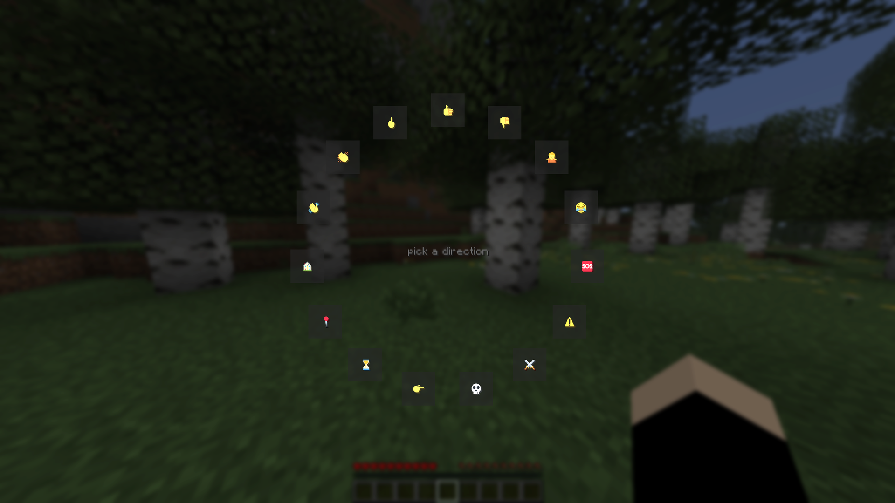
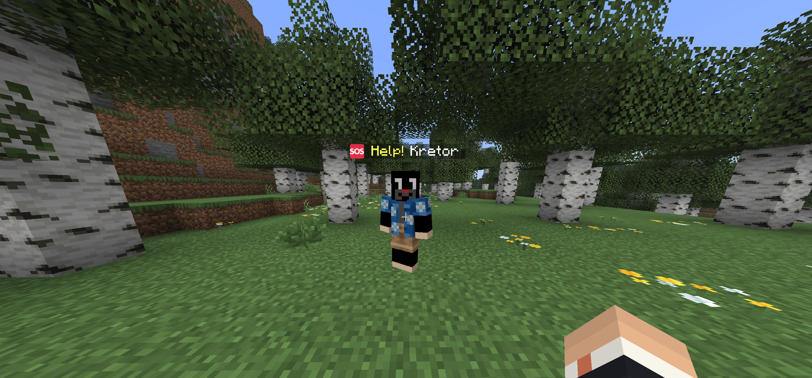

<div align="center">

<sub><a href="README.md">Polski</a> · <b>English</b></sub>

<sub><a href="CHANGELOG.en.md">Changelog</a></sub>

# 👁🔇🔈 Blind Mute Deaf

**A party game mode where every player loses one sense — and has to get the job done anyway.**

The blind player sees nothing. The mute player cannot speak. The deaf player hears nothing.
To work around it: a gesture wheel above the head and item signs.

[](../../releases/latest)
&nbsp;

&nbsp;




</div>

---

**Fabric 26.2** (Java 25). Requires [Fabric API](https://modrinth.com/mod/fabric-api).
[Simple Voice Chat](https://modrinth.com/mod/simple-voice-chat) is optional, but without it
Mute and Deaf lose half their point.

The mod has to be installed **on the server and on every client** — blindness, the sound
cut-off and the gesture wheel all live on the client side. With `requireClientMod` (on by
default) players without it are kicked at login instead of silently playing an easier game.

## What it looks like

| | |
|---|---|
|  |  |
| **The gesture wheel** — hold Left Ctrl, aim with the mouse, release. | **Through the blind player's eyes** — a sound fires a wave that lights up the shape of the surroundings. |
|  |  |
| **Calling for help** — the mute player cannot say this out loud or in chat. | **Gestures sit on the nametag** — visible from any distance. |


## The classes

| Class | What it takes away | What it gives back |
|-------|--------------------|--------------------|
| 👁 **Blind** | Screen completely black | 3D echolocation: every sound fires a wave that lights up the shape of the room |
| 🔇 **Mute** | Microphone cut off server-side, no chat, no damage | Gesture wheel + a sign showing any item |
| 🔈 **Deaf** | No sound at all (game and voice), no right-click | Speaks normally, sees every gesture |

Blindness is **not** the Blindness effect — it is a black rectangle on the very top of the
HUD. Blindness can be brightened with the gamma slider and still lets you see blocks right
in front of your face; there is no working around this one.

Voice is handled **server-side** through the Simple Voice Chat API: the mute player's
microphone packet is cancelled, the deaf player is never sent audio packets. Nothing in a
player's own SVC config changes that.

## Commands

```
/bmd                          describe your own class (anyone)
/bmd random [players]         deal the three classes out evenly
/bmd set <players> <class>    blind | mute | deaf | none
/bmd mode <easy|normal|hard>  how blind the blind player is (saved to the config)
/bmd list                     who has what
/bmd reset                    clear everything

/bmd goal                     which challenge is running, and for how long (anyone)
/bmd goal random <difficulty> roll a goal: easy | normal | hard
/bmd goal set <id>            a specific goal
/bmd goal list <difficulty>   the 20 goals of that difficulty
/bmd goal clear               drop the challenge
```

Everything except `/bmd`, `/bmd info`, `/bmd goal` and `/bmd goal list` requires gamemaster
permission (the old level 2). Completing a goal lifts every restriction at once.

## Keys

| Key | Action |
|-----|--------|
| **Left Ctrl** (hold) | gesture wheel — aim with the mouse, release the key |
| **Left Alt** | item sign (mute player only) |

Gestures: Yes ✔, No ✕, Help ❤, Danger ⚠, Follow me ➜, Wait ⌛, No idea ?, Ha ha ☺.
Each has its own sound — the blind player hears that someone is signalling, but not what.

## Configuration

`bmd_config.json` in the world folder, created on first start.
Debuffs enabled by default: `muteCannotAttack`, `muteCannotChat`, `deafCannotUseItems`.

Keys that work:

| Key | Default | Effect |
|-----|---------|--------|
| `muteCannotAttack` | `true` | the mute player deals no damage to anything (arrows included) |
| `muteCannotChat` | `true` | no chat for the mute player, and no `/msg`, `/me`, `/say` |
| `muteItemSign` | `true` | the mute player can hold any item up above their head |
| `deafCannotUseItems` | `true` | no right-click for the deaf player (eating still works) |
| `onlyBlindCanCraft` | `true` | only the blind player may craft |
| `requireClientMod` | `true` | kicks players without the mod on their client |
| `blindMode` | `"NORMAL"` | `EASY` \| `NORMAL` \| `HARD` — same as `/bmd mode` |
| `blindEchoRange` | `24.0` | echolocation range in blocks |
| `blindShowHud` | `true` | the black goes under the HUD (hotbar and bars stay visible) |
| `blindEasyDarkness` | `0.6` | extra screen dimming in `EASY` mode (0.0–1.0) |

Keys that are written to the config but **do nothing yet** — setting them to `true` only adds
a line to the class description: `muteCannotOpenContainers`, `muteHalfDamage`,
`deafHidesNameTags`, `deafMinesSlower`, `deafAggroRangeDoubled`, `blindSlowness`.

## Building

```bash
./gradlew build          # → build/libs/bmd-<version>.jar
./gradlew runServer      # development server
java src/main/java/dev/kajor/bmd/Geometry.java   # math self-check
```

Requires JDK 25 (MC 26.2). The path to it lives in `gradle.properties` as `org.gradle.java.home`.

## License

MIT — see [LICENSE](LICENSE).
